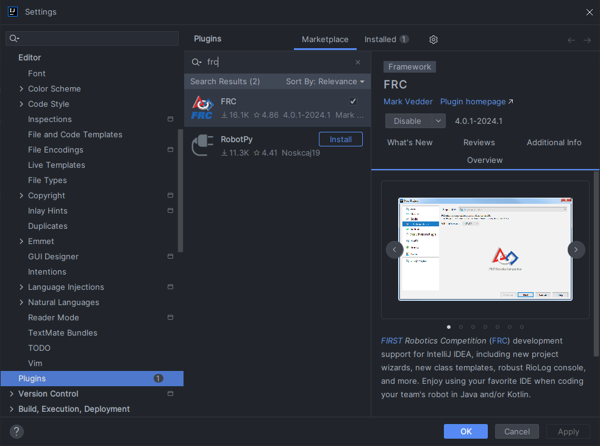

# IntelliJ IDEA
Rather than VS Code, when developing with Kotlin the reccomended IDE is IntelliJ. IntelliJ offers much better autocomplete and syntax highlighting when using Kotlin and Java together (which we always are, as WPILib's JVM portion is written in Java)

There are two versions of IntelliJ, "Community" and "Ultimate". The "Community" version is free, and is therefore the most easily accessible option, but if you already are paying for IntelliJ Ultimate (or are using JetBrains' student license to get it for free), this is perfectly fine and it will not be any different from the the "Community" edition. JetBrains has a good article on the installation process which can be found [HERE](https://www.jetbrains.com/help/idea/installation-guide.html), just make sure you download IntelliJ Community if you're not intending on paying to use it.

# FRC plugin for IntelliJ
Some of the features provided by the WPILib VSCode Plugin are provided via plugin as well for IntelliJ. The plugin can be installed automatically via the plugin dialog: `File > Settings > Plugins`. Search for `FRC` in the Marketplace. The _FRC_ plugin provides features such as
- class templates
- project creation wizard
- RIOLog viewer

## Creating a new FRC Project
Open the project creation dialog by selecting `File > New > Project`. In the `Generators` section, choose `FRC Robot Project`. Configuring your robot project using the FRC plugin is similar to the WPILib VSCode Plugin. Refer to [the WPILib documentation](https://docs.wpilib.org/en/stable/docs/software/vscode-overview/creating-robot-program.html) for details on configuration options.
