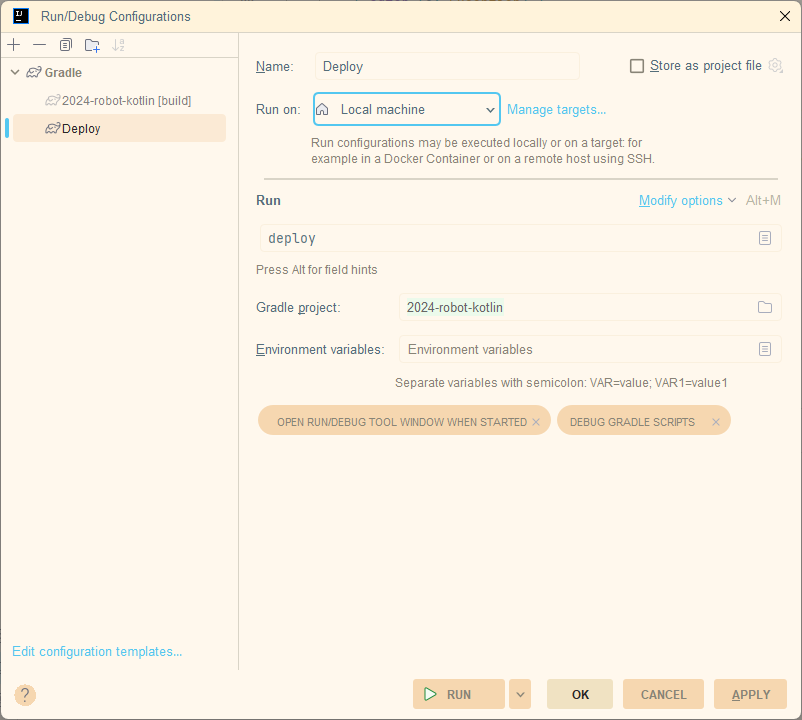

# Running your Robot Program

## Deploying to the Robot

To deploy your robot program to the robot, you will need to use the `deploy` gradle command. This
command
will compile your robot program and deploy it to the robot.

There are two ways of running the `deploy` command:

- Through the command line
- Through a run configuration in IntelliJ

### Deploying manually via the command line

1. Open a terminal window. You can use the terminal window in IntelliJ or your system terminal. To
   open the terminal window in IntelliJ, click on the terminal tab at the bottom of the window or
   `View > Tool Windows > Terminal`.

2. Navigate to the root directory of your robot program. If you are using the terminal in IntelliJ,
   you can use the `cd` command to navigate to the root directory of your robot program.

3. Run the `deploy` command by typing `./gradlew deploy` (`gradlew.bat deploy` on Windows) and
   pressing enter.

### Deploying via IntelliJ

1. Create a new run configuration by clicking on the dropdown next to the run button in the top
   right corner of the IntelliJ window and selecting `Edit Configurations`.
2. Click on the `+` button in the top left corner of the window and select `Gradle`. Under the `Run`
   field type `deploy`. The `Gradle project` should be your project. Click `OK`.
   

3. Click on the run button in the top right corner of the IntelliJ window to deploy your robot
   program to the robot.

## Simulating Robot Code

FRC code made with kotlin can be simulated on your computer, just like robot code written with Java, Python, or C++. To do so,either follow the "Deploying via IntelliJ" or "Deploying manually via the command line" instructions above, but replace the "deploy" keyword with the "simulateJava" keyword(I.E `./gradlew simulateJava` on Windows Powershell or a Unix shell).

WPILib's simulation allows you to run your code locally on your computer, without an actual robot. This should be used in conjunction with the WPILib simulation classes to simulate your mechanisms; read more about the physics simulation API [here](
https://docs.wpilib.org/en/stable/docs/software/wpilib-tools/robot-simulation/physics-sim.html).
